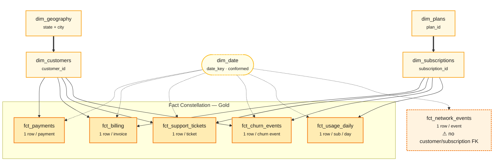

# MYConnect Analytics — End-to-End Architecture

Synthetic generation → GCS → BigQuery Medallion (Bronze · Silver · Gold · Mart) → Looker.

Built with **Dataform 3.0.52** on **BigQuery** (`asia-southeast1`). All model names below are the actual implemented models.

---

## 1. End-to-End Pipeline

```mermaid
flowchart LR

%% ─────────────── SOURCE ───────────────
subgraph SRC["1 · SOURCE — Synthetic Generation"]
  direction TB
  GEN["Python Generator<br/>ingestion/synthetic_data_gen<br/>seed = 42 · deterministic"]
  S1["Customer<br/>customers · subscriptions · plans"]
  S2["Billing<br/>billing · bill_line_items · payments"]
  S3["Usage &amp; Network<br/>usage_daily · network_events"]
  S4["Support · Churn · Promo<br/>support_tickets · churn_events · promotions"]
  GEN --> S1
  GEN --> S2
  GEN --> S3
  GEN --> S4
end

%% ─────────────── LANDING ───────────────
subgraph LAND["2 · LANDING — Google Cloud Storage"]
  direction TB
  GCS["GCS Raw Bucket<br/>Parquet · 11 datasets"]
end

%% ─────────────── BRONZE ───────────────
subgraph BRZ["3 · BRONZE — myconnect_bronze"]
  direction TB
  BRAW["11 Raw Tables<br/>exact source copy · no transforms"]
  BDECL["Dataform Declarations<br/>raw_*.sqlx × 11"]
  BRAW --> BDECL
end

%% ─────────────── SILVER ───────────────
subgraph SLV["4 · SILVER — myconnect_silver"]
  direction TB
  subgraph STG["Staging · stg_* × 11"]
    direction TB
    STGA["Cleansing &amp; Standardisation<br/>dedup · type casts · status/city normalise<br/>date-inversion repair · orphan FK filter"]
    STGB["stg_usage_daily<br/>INCREMENTAL · 3-day late-arrival lookback"]
  end
  subgraph INT["Intermediate · int_* × 7"]
    direction TB
    INTA["Reconciliation<br/>int_billing_reconciliation<br/>int_payment_reconciliation"]
    INTB["Customer Logic<br/>int_customer_subscriptions<br/>int_customer_tenure"]
    INTC["Operational Metrics<br/>int_ticket_metrics · int_network_impact<br/>int_monthly_revenue"]
  end
  STGA --> INTA
  STGA --> INTB
  STGA --> INTC
  STGB --> INTC
end

%% ─────────────── DQ GATE 1 ───────────────
subgraph DQ1["5 · DQ GATE — Silver"]
  direction TB
  G1{{"ASSERTION GATE<br/>must pass to proceed"}}
  A1["assert_subscriptions_no_orphan_customers<br/>assert_usage_no_negative_volumes<br/>assert_usage_speed_within_plan_cap"]
  A1 --- G1
end

%% ─────────────── GOLD ───────────────
subgraph GLD["6 · GOLD — myconnect_gold · Star / Galaxy Warehouse"]
  direction TB
  subgraph DIMS["Conformed Dimensions"]
    direction LR
    D1["dim_date"]
    D2["dim_customers"]
    D3["dim_subscriptions"]
    D4["dim_plans"]
    D5["dim_geography"]
  end
  subgraph FACTS["Fact Tables"]
    direction LR
    F1["fct_billing"]
    F2["fct_payments"]
    F3["fct_usage_daily"]
    F4["fct_support_tickets"]
    F5["fct_churn_events"]
    F6["fct_network_events"]
  end
  DIMS -. "conformed dimension bus<br/>see §2 for real keys" .- FACTS
end

%% ─────────────── DQ GATE 2 ───────────────
subgraph DQ2["7 · DQ GATE — Gold"]
  direction TB
  G2{{"ASSERTION GATE<br/>must pass to proceed"}}
  A2["assert_dim_customers_unique<br/>assert_network_duration_non_negative"]
  A2 --- G2
end

%% ─────────────── MART ───────────────
subgraph MRT["8 · MART — myconnect_mart · Business Aggregates"]
  direction TB
  M1["mart_revenue"]
  M2["mart_customer_360"]
  M3["mart_churn"]
  M4["mart_service_quality"]
  M5["mart_customer_support"]
  M6["mart_revenue_assurance"]
end

%% ─────────────── LOOKER ───────────────
subgraph LKR["9 · LOOKER — Semantic &amp; BI"]
  direction TB
  LEX["Looker Explores<br/>one Explore per fact<br/>many:1 dimension joins only"]
  BAN["Silver is NEVER exposed to Looker"]
end

%% ─────────────── DASHBOARDS ───────────────
subgraph DSH["10 · DASHBOARDS — Business Consumption"]
  direction TB
  P1["Executive Overview"]
  P2["Customer &amp; Subscriber"]
  P3["Revenue &amp; Billing"]
  P4["Churn &amp; Retention"]
  P5["Service Quality &amp; Support"]
  P6["Revenue Assurance"]
end

USERS["Executives · Analysts<br/>Finance · Revenue Assurance"]

%% ─────────────── MAIN FLOW ───────────────
S1 --> GCS
S2 --> GCS
S3 --> GCS
S4 --> GCS
GCS ==> BRAW
BDECL ==> STGA
BDECL ==> STGB
INT ==> G1
G1 ==>|PASS| DIMS
G1 ==>|PASS| FACTS
GLD ==> G2
G2 ==>|PASS| MRT
GLD -->|"detail · filterable · drillable"| LEX
MRT -->|"headline KPIs · monthly trends"| LEX
LEX --> P1
LEX --> P2
LEX --> P3
LEX --> P4
LEX --> P5
LEX --> P6
DSH --> USERS

%% ─────────────── STYLING ───────────────
classDef src   fill:#E8EAF6,stroke:#5C6BC0,stroke-width:1px,color:#1A1A1A
classDef land  fill:#E0F2F1,stroke:#26A69A,stroke-width:1px,color:#1A1A1A
classDef bronze fill:#EFEBE9,stroke:#8D6E63,stroke-width:1px,color:#1A1A1A
classDef silver fill:#ECEFF1,stroke:#78909C,stroke-width:1px,color:#1A1A1A
classDef gate  fill:#FFE0B2,stroke:#EF6C00,stroke-width:3px,color:#1A1A1A
classDef assert fill:#FFF3E0,stroke:#FB8C00,stroke-width:1px,color:#1A1A1A
classDef dim   fill:#FFF8E1,stroke:#F9A825,stroke-width:2px,color:#1A1A1A
classDef fact  fill:#FFECB3,stroke:#F57F17,stroke-width:2px,color:#1A1A1A
classDef mart  fill:#E8F5E9,stroke:#43A047,stroke-width:1px,color:#1A1A1A
classDef looker fill:#E3F2FD,stroke:#1E88E5,stroke-width:1px,color:#1A1A1A
classDef dash  fill:#F3E5F5,stroke:#8E24AA,stroke-width:1px,color:#1A1A1A
classDef users fill:#FAFAFA,stroke:#424242,stroke-width:2px,color:#1A1A1A
classDef ban   fill:#FFEBEE,stroke:#C62828,stroke-width:2px,color:#B71C1C

class GEN,S1,S2,S3,S4 src
class GCS land
class BRAW,BDECL bronze
class STGA,STGB,INTA,INTB,INTC silver
class G1,G2 gate
class A1,A2 assert
class D1,D2,D3,D4,D5 dim
class F1,F2,F3,F4,F5,F6 fact
class M1,M2,M3,M4,M5,M6 mart
class LEX looker
class BAN ban
class P1,P2,P3,P4,P5,P6 dash
class USERS users
```

---

## 2. Gold Star / Galaxy Schema — Real Key Relationships

Six fact tables sharing five conformed dimensions, laid out as a galaxy schema: dimension hierarchies feed down into a central fact layer, `dim_date` conforms lightly across every fact, and `fct_network_events` sits isolated as an infrastructure-only telemetry fact. Every edge below is a real foreign key present in the implemented models — no inferred joins.

**Reading the layout:** the two side chains (`dim_geography → dim_customers` and `dim_plans → dim_subscriptions`) are real dimension hierarchies feeding solid, bold arrows down into whichever facts they actually key — `dim_customers` skips `fct_usage_daily`, `dim_subscriptions` skips `fct_payments`, exactly as implemented. `dim_date` sits centered above the constellation with light dotted arrows, since it conforms to all six facts equally but isn't a hierarchy. `fct_network_events` is drawn apart from the fact constellation with only a dotted `dim_date` link — no customer or subscription edge exists because none is implemented.

---

## Legend

| Element | Meaning |
|---|---|
| **Medallion layers** | `Bronze` raw copy → `Silver` cleansed + business logic → `Gold` dimensional warehouse → `Mart` business aggregates. Thick arrows (`==>`) mark the main medallion path. |
| **DQ gates** (orange hexagons) | Dataform assertions. **Gate 1** validates Silver (3 assertions: orphan FKs, negative usage, plan-relative speed cap). **Gate 2** validates Gold (2 assertions: dimension uniqueness, non-negative network duration). Downstream models build only after a gate passes. |
| **Gold Star / Galaxy** (amber) | Five conformed dimensions shared across six fact tables — a galaxy schema. §2 shows the real FK relationships; the pipeline diagram shows the dimension bus conceptually to stay readable. |
| **Gold → Looker** | Detailed, filterable, drillable analysis at business grain. |
| **Mart → Looker** | Pre-computed headline KPIs and monthly trends. |
| **Silver → Looker** | 🚫 **Never.** Silver is not exposed to the BI layer under any circumstance. |

### Implementation notes

- `bill_line_items` flows Bronze → `stg_bill_line_items` → `int_billing_reconciliation` only; there is **no Gold fact** for it. A `fct_bill_line_items` is a documented prerequisite for the Revenue Assurance charge-type analysis (see `dashboard_planning.md`) but is **not yet implemented**.
- `stg_promotions` and `int_monthly_revenue` are implemented but not currently consumed by any Gold model.
- `stg_usage_daily` is the only incremental Silver model (3-day lookback for late-arriving records).
